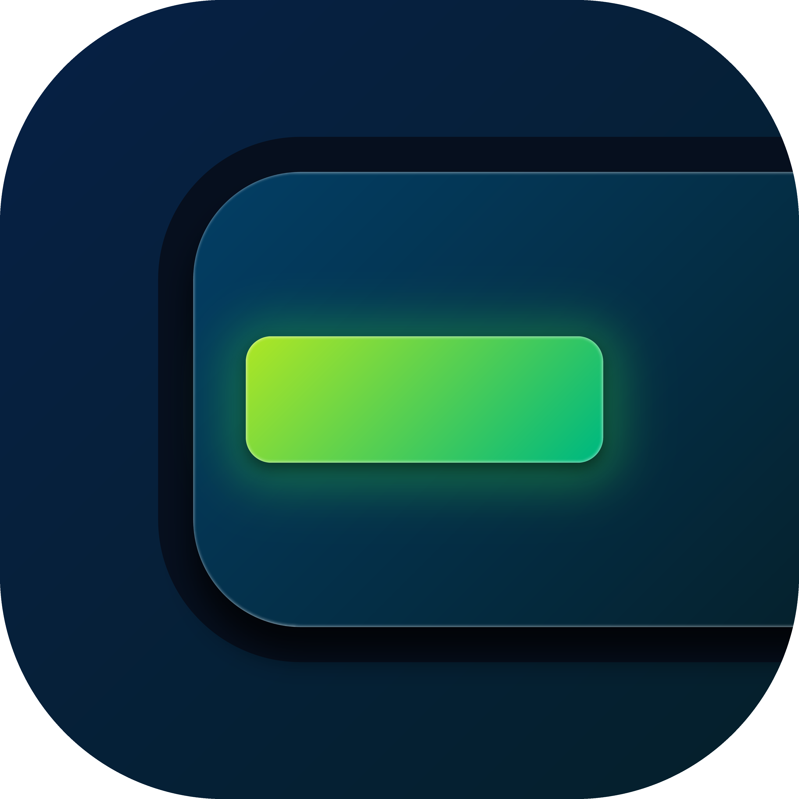

 

    
    
SpaceView

 

Display all Meetings for your room on a Display, Spaceview supports Nextcloud RoomVox and iCal Calendars. Also you have some options to customize Spaceview.

## Calendar Providers
We support currently the following calendar providers:
- iCal (.ics)
- Nextcloud Roomvox
- ~~Google Workspace (planed)~~
- ~~Outlook (planed)~~

## Customization
You can add a logo, change the background image and change the acent color. If you use a Nextcloud Provider, you can automaticaly use your default images and color from your Server Theme.\
You can also add your own images to the app to use them.

## Development

### Run local
View the instructions in [KOTLIN.md](KOTLIN.md)

### Change Version
#### GitHub Action
The version will be set automatically from the realease tag.

#### Local
Open the [gradle.properties](gradle.properties) file and change the following values:
- `app.version`: for the global App Version (1.0.0)
- `android.versionCode`: for the Android Build number (needs to be counted +1 for every Play Store Build)
- `ios.buildNumber`: for the iOS Build number (needs to be counted +1 for every App Store Build)

After changing the values, run `./gradlew syncIosVersion` to update the iOS version.